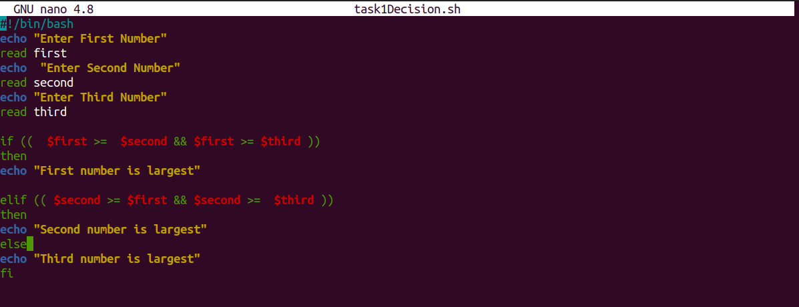
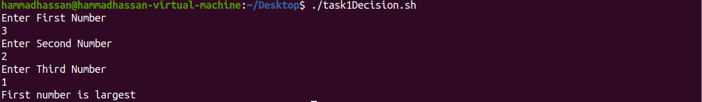
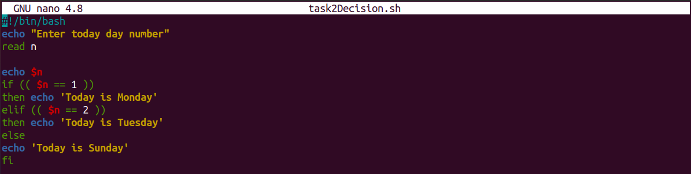
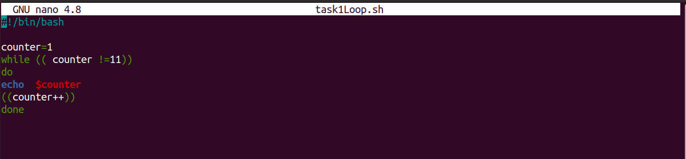
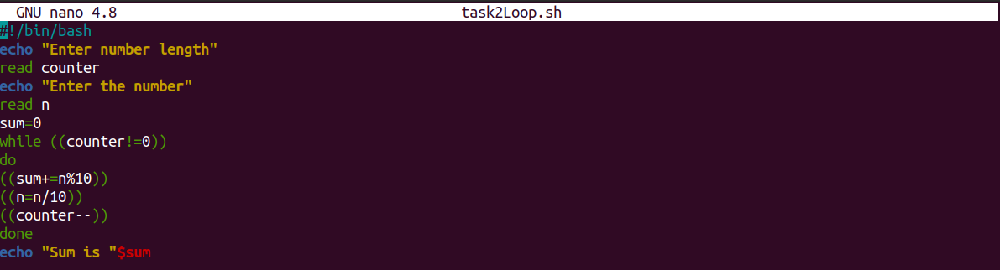
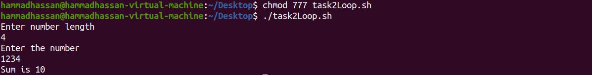
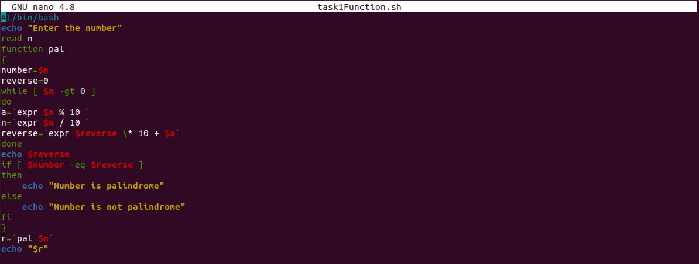
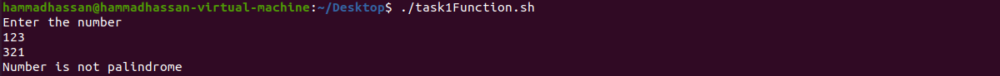
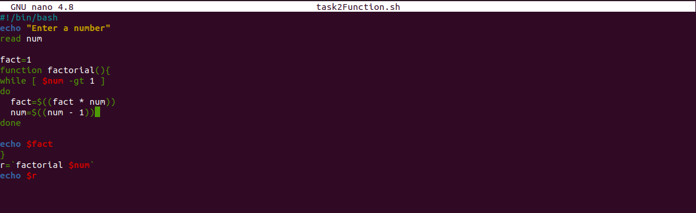
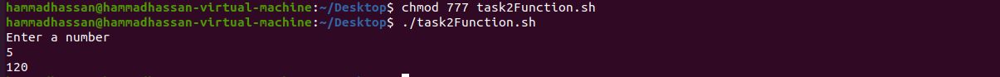

# Lab-04 Shell Scripting

In this lab we will learn how to perform the following task,

1. Conditional Statements
2. Loops
3. Functions

All of these task will be performed using the Shell Scripting which is power way to write the commands in the ubuntu operating system.

In all files it is required that give the permission to read, write and execute by using following command

```bash
chmod 777 [filename]
```

 The 777 grant the  read, write and execute permission.  

## 1. Conditional Statements

The decisions making in the shell scripting give new power to perform the complex task. 

**Syntax** 

```bash
if ((condition))
then # *block of code to be executed if the condition is true*
fi
```

**Note** Make sure that you close the if statement with fi.

#### **Examples**

**Question-01**

Create a Bash script which will take 3 numbers as command line arguments. It
will print to the screen the larger of the three numbers

**Solution**

```bash
nano task2Decision.sh
```

Open the terminal based  text editor using the nano keyword follow by the file name where the  file will be stored. e.g


After writing the code into the terminal 

Press CTRL+X command to save the file

Save modify buffer by pressing Y 

Press Enter to close the Nano text editor

e.g



Run the file on the terminal using the following command 

```bash
 ./task1Decision.sh
```

It will run the the script on the terminal.e.g




**Question-02**

Create a Bash script which will print a message based upon which day of the
week it is (eg. 3 for Wednesday, 5 for Friday etc) using
switch statement.

**Solution**

````bash
nano task2Decision.sh
````

Open the terminal based  text editor using the nano keyword follow by the file name where the  file will be stored. e.g

After writing the code into the terminal 

Press CTRL+X command to save the file

Save modify buffer by pressing Y 

Press Enter to close the Nano text editor

e.g



Run the file on the terminal using the following command 

```bash
 ./task2Decision.sh
```

It will run the the script on the terminal.e.g


### 2. Loops

Loops are used to perform the repetitive task in the easier way.

**Syntax** 

```bash
while ((condition))
do
then # *block of code to be executed if while the condition is true*
done
```

**Note** Make sure that you close the loop with then keyword.

**Question-01**

Create a simple script which will print the numbers 1 - 10 (each on a separate line) and whether they are even or odd.

**Solution**

````bash
nano task1Loop.sh
````

Open the terminal based  text editor using the Nano keyword follow by the file name where the  file will be stored. e.g


After writing the code into the terminal 

Press CTRL+X command to save the file

Save modify buffer by pressing Y 

Press Enter to close the Nano text editor

e.g



Run the file on the terminal using the following command 

```bash
 ./ task1Loop.sh
```

It will run the the script on the terminal.e.g


**Question-02**

**Solution**

````bash
nano task2Loop.sh
````

Open the terminal based  text editor using the Nano keyword follow by the file name where the  file will be stored. e.g


After writing the code into the terminal 

Press CTRL+X command to save the file

Save modify buffer by pressing Y 

Press Enter to close the Nano text editor

e.g



Run the file on the terminal using the following command 

```bash
 ./ task2Loop.sh
```

It will run the the script on the terminal.e.g



### 3. Functions

Functions are used to divide the all program or set of instruction into smaller independent parts

**Syntax** 

```bash
function funcionName{
 # *block of code to be executed when the control will be enter*
}
```

**Note** Make sure that you start and end with curly brackets. 

**Question-01**

Write a shell script which takes a positive integer as an argument on the terminal and then checks if it is a palindrome or not. In order to find the reverse of this number it must be passed to function named reverse(), which computes the reverse and passes both, the number and its reverse to another function called palindromeCheck(). palindromeCheck() then compares the numbers and echoes if the number is a palindrome or not. 

**Solution**

````bash
nano task1Function.sh
````

Open the terminal based  text editor using the Nano keyword follow by the file name where the  file will be stored. e.g


After writing the code into the terminal 

Press CTRL+X command to save the file

Save modify buffer by pressing Y 

Press Enter to close the Nano text editor

e.g

Run the file on the terminal using the following command 

```bash
 ./ task1Function.sh
```

It will run the the script on the terminal.e.g



**Question-02**

**Solution**

````bash
nano task2Function.sh
````

Open the terminal based  text editor using the Nano keyword follow by the file name where the  file will be stored. e.g


After writing the code into the terminal 

Press CTRL+X command to save the file

Save modify buffer by pressing Y 

Press Enter to close the Nano text editor

e.g



Run the file on the terminal using the following command 

```bash
 ./ task2Function.sh
```

It will run the the script on the terminal.e.g

